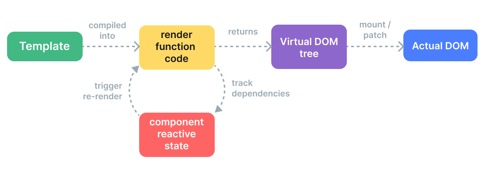

> 项目中代码已经添加注释

## 目录

[toc]



## vue文件到DOM元素经历的过程

在Vue 3中，`.vue`文件最终会被编译成一个`render`函数（`() => h(*****)`），每次执行渲染函数都会得到新的虚拟节点对象，用于生成组件的虚拟节点（`vnode`），然后通过Vue 3内置的`createApp`函数创建一个Vue实例，将`vnode`挂载到该实例的根节点上，最终生成真实的DOM节点。

具体的编译和渲染过程可以简单概括为以下几个步骤：

1. 解析`.vue`文件：Vue 3通过内置的`@vue/compiler-sfc`模块，将`.vue`文件解析为一个包含`template`、`script`和`style`三个部分的对象。其中，`template`部分包含了组件的模板代码，`script`部分包含了组件的逻辑代码，`style`部分包含了组件的样式代码。
2. 编译`template`部分：通过Vue 3内置的`compile`函数，将`template`部分的模板代码编译成一个`render`函数。编译过程中，Vue 3会将模板中的指令、事件绑定、插值等转换成对应的`vnode`节点，最终生成一个包含了所有节点信息的`render`函数。
3. 创建组件实例：通过Vue 3内置的`createComponentInstance`函数，创建组件的实例对象。该函数会根据组件的选项对象创建一个组件实例，并将组件实例的配置信息（如`props`、`methods`、`data`等）与编译生成的`render`函数进行关联。
4. 执行渲染函数：通过Vue 3内置的`setupRenderEffect`函数，执行编译生成的`render`函数，并将生成的`vnode`节点与组件实例对象的`_vnode`属性进行绑定。这个过程中，Vue 3会自动对组件中使用的响应式数据进行依赖追踪，从而在数据发生变化时能够触发`render`函数的重新执行。
5. 挂载DOM节点：通过Vue 3内置的`createApp`函数，创建Vue实例，并将生成的`vnode`节点挂载到该实例的根节点上。在这个过程中，Vue 3会将`vnode`节点转换成真实的DOM节点，并将其添加到DOM树中。

## Compile

在 Vue 3 中，`compile-core`、`compile-dom`、`compile-sfc` 和 `compile-ssr` 都是 Vue 内置的编译器模块，它们之间的关系如下：

1. `compile-core` 是 Vue 编译器的核心模块，它定义了编译器的基本逻辑和 API，包括模板解析、 AST 转换、代码生成等功能。`compile-core` 模块不依赖于特定的平台（如浏览器、服务器等），因此可以用于多种环境下的编译任务。
2. `compile-dom` 是针对浏览器环境的编译器模块，它基于 `compile-core` 模块扩展了一些浏览器特有的编译逻辑，比如元素属性的处理、事件处理等。`compile-dom` 模块将编译结果生成为浏览器可以直接渲染的 DOM 树。
3. `compile-ssr` 是针对服务器端渲染（Server-Side Rendering，SSR）的编译器模块，它同样基于 `compile-core` 模块，但会针对服务器端渲染的特点进行一些优化，如静态节点提取、片段缓存等。`compile-ssr` 模块将编译结果生成为字符串形式的 HTML。
4. `compile-sfc` 是 Vue 单文件组件（Single-File Components，SFC）的编译器模块，它基于 `compile-core` 模块和 `compile-dom` 模块，将单文件组件中的模板、样式和脚本分别编译成渲染函数、CSS 样式和 JS 代码。`compile-sfc` 模块是 Vue CLI 和 Vite 等前端构建工具的核心模块之一。

这些编译器模块之间存在一定的依赖关系，比如 `compile-dom` 和 `compile-ssr` 都依赖于 `compile-core` 模块，而 `compile-sfc` 则同时依赖于 `compile-core` 和 `compile-dom` 两个模块。这些模块之间的协作，使得 Vue 编译器能够适应不同的编译场景，实现了一定程度的复用和解耦。

### 虚拟语法树

所有编译函数的编译结果（返回值）对象中都包含一个`ast`属性。

在 Vue 3 中，虚拟语法树（Abstract Syntax Tree，AST）是 Vue 编译器的一个重要概念，用于**描述模板代码的抽象语法结构**。Vue 3 的编译器会先将模板代码解析成 AST，然后再将 AST 转换成可执行的渲染函数，最终用于生成真实的 DOM 节点。

Vue 3 的 AST 是一个基于 JSON 格式的**对象**，用于表示模板代码中的各种语法结构。一个简单的 Vue 3 模板代码的 AST 结构可能如下所示：

```json
{
  "type": 1,
  "tag": "div",
  "props": [],
  "children": [
    {
      "type": 2,
      "content": "Hello, {{ name }}!",
      "expression": {
        "type": 4,
        "content": "name"
      }
    }
  ]
}
```

其中，`type` 表示节点的类型，1 表示普通元素节点，2 表示文本节点，4 表示简单表达式节点，等等。`tag` 表示元素节点的标签名，`props` 表示元素节点的属性列表，`children` 表示元素节点的子节点列表。对于文本节点和简单表达式节点，它们分别用 `content` 和 `expression` 属性来表示它们的内容和表达式。

Vue 3 的 AST 还支持一些高级的语法结构，比如条件表达式、循环语句、事件绑定等，这些语法结构的对应节点类型和属性也都有所不同。Vue 3 的 AST 通过一系列的转换和优化过程，最终会被转换成可执行的渲染函数。在开发过程中，我们可以使用 Vue 3 提供的编译器 API 来直接操作 AST，实现一些高级的模板功能，比如自定义指令、动态组件等。

### compile-sfc

- 文件：`vuejs.core\packages\compiler-sfc\src\compileTemplate.ts`

- 函数：`compileTemplate` --->`doCompileTemplate` 

### AST ---> VNode

将 AST 转化为 `vnode` 的过程主要涉及以下几个函数：

1. `baseCreateVNode`：创建 `vnode` 对象的函数，它接收多个参数，包括节点类型、节点属性、子节点等信息，并返回一个 `vnode` 对象。
2. `createVNodeTransform`：用于生成 AST 转换器的函数，返回一个对象，其中包含 `transformElement` (`vuejs.core\packages\compiler-core\src\transforms\transformElement.ts`)、`transformSlotOutlet` 等方法，用于将 AST 节点转换成 `vnode` 对象。
   在`baseCompile`中调用了`getBaseTransformPreset`函数，得到`nodeTransforms`**函数列表**，包含大量的transform函数。
   之后调用了`transorm`函数，传入ast对象。
3. `transform`：用于执行 AST 转换的函数，接收 AST 树和一组转换器作为参数，将 AST 树中的节点依次传入转换器进行转换，并返回转换后的结果。

这些函数一起工作，可以将 AST 树转换为 `vnode` 对象，具体流程如下：

1. 通过 `createVNodeTransform`函数生成 AST 转换器，包括 `transformElement`、`transformSlotOutlet` 等方法，用于将 AST 节点转换成 `vnode` 对象。
2. 调用 `transform` 函数，将 AST 树和生成的转换器作为参数传入，开始执行 AST 转换。
3. `transform` 函数遍历 AST 树中的每一个节点，并根据节点类型选择相应的转换器进行转换。
4. `transformElement` 方法会将 AST 树中的普通元素节点转换成 `vnodeCall` 对象，包括节点类型、节点属性、子节点等信息。对于子节点，会递归调用 `transform` 方法进行转换。
5. `transformSlotOutlet` 方法用于转换插槽节点，将其转换为带有 `name` 和 `children` 属性的 `vnode` 对象。
6. 最终，`transform` 函数返回转换后的 `vnode` 对象。

总的来说，将 AST 转换为 `vnode` 的过程需要用到 `createVNodeTransform`、`transform` 和 `transformElement`、`transformSlotOutlet` 等函数，并通过遍历 AST 树，将 AST 节点转换为 `vnodeCall` 对象。

### transform中的onExit()函数

`transformXXX`函数用来转换一些vue语法，例如`v-if`, `v-for`，经`transformsXXX`函数处理过的AST节点会被挂载`codeGenNode`属性（其实就是调用vnode创建的interface），该属性包含patchFlag等在AST解析阶段无法获得的信息，**其作用就是为了在后面的generate阶段生成vnode的创建调用**。

`transformElement`和`transformText`转换后都返回了一个`onExit`回调函数，在这个函数内部挂载`codeGenNode`属性——当所有转换函数执行完毕后再执行`onExit`函数。为什么？

所有转换函数都会判断node的类型再执行，一个node只会被一个转换函数处理（转换函数是给AST节点挂载`codeGenNode`属性，重复执行也会被覆盖）。

这里需要介绍这两个转换函数的作用，`transformElement`函数处理节点类型为：

```ts
 node.type === NodeTypes.ELEMENT &&
        (node.tagType === ElementTypes.ELEMENT ||
          node.tagType === ElementTypes.COMPONENT)
```

它最终返回节点的`VNodeCall`接口（`VNodeCall`接口，它定义了虚拟节点的属性和方法）。

`VNodeCall`类型和`VNode`类型的区别是：

- `VNodeCall`类型是一个接口，它定义了虚拟节点的属性和方法，但它不是一个实例化的对象
- `VNode`类型是一个类，它实现了`VNodeCall`接口，并且有一些额外的字段，如el（真实DOM元素），shapeFlag（虚拟节点的形状），key（虚拟节点的唯一标识），等等
- `VNodeCall`类型是用来**创建虚拟节点的参数**，而`VNode`类型是用来表示虚拟节点的对象
- `VNodeCall`类型可以通过h函数或JSX语法转换成`VNode`类型

> `VNodeCall`只有属性而没有方法。
>
> `VNodeCall`的类型定义：`vuejs.core\packages\compiler-core\src\ast.ts`
>
> `VNode`的类型定义：`vuejs.core\packages\runtime-core\src\vnode.ts`
>
> 每个节点都有一个对应的VNodeCall，用来创建VNode。

因此`transformElement`返回一个用来创建`VNode`的接口，**它必须保证它的子节点被转换完毕后再执行**，因此在`onExit`阶段才执行转换操作。

## Vnode和ComponentInstance对象

- `vnode`（Virtual DOM Node）：虚拟节点，是Vue内部用来**描述DOM节点的JavaScript对象**。每个vnode包含节点的标签名、属性、子节点等信息，它们可以通过渲染函数或者组件的render方法生成。在Vue的数据变化检测过程中，Vue会比对新旧vnode之间的差异，并根据差异更新DOM。因为vnode的创建和比对都在JavaScript中进行，所以相对于直接操作DOM，它们更加高效、灵活和安全。
- `component instance`：组件实例，是Vue**中表示组件状态和行为的对象**。每个组件实例都是通过Vue构造函数创建的，包含了组件的选项、数据、方法和生命周期等信息。在组件渲染的过程中，Vue会为每个组件实例创建一个对应的vnode，并在需要时更新组件实例的状态，以便生成新的vnode。组件实例还可以通过this关键字在组件内部访问自己的状态和方法，以及访问父级组件、子组件和全局Vue实例等。因此，组件实例是Vue中非常重要的一个概念，可以方便地实现组件之间的交互和通信。

## SetupContext对象

[setup context是一个对象，它提供了组件的一些功能。你可以用两种方式使用组合式API：一种是使用setup()函数，另一种是使用<script setup>语法](https://www.webmound.com/vue-context-argument-composition-api-script-setup/)[1](https://www.webmound.com/vue-context-argument-composition-api-script-setup/)。

[在setup()函数中，你可以通过第二个参数来访问setup context，它有四个属性：attrs、slots、emit和expose](https://www.webmound.com/vue-context-argument-composition-api-script-setup/)[1](https://www.webmound.com/vue-context-argument-composition-api-script-setup/)。

[在<setup script>语法中，你不能直接访问setup context对象，而要使用Vue提供的一些辅助函数来获取相应的属性](https://www.webmound.com/vue-context-argument-composition-api-script-setup/)[2](https://www.webmound.com/vue-context-argument-composition-api-script-setup/)。例如：

- useAttrs()函数可以访问attrs对象
- defineEmits()函数可以发送自定义事件
- defineExpose()函数可以暴露组件实例的属性或方法
- useSlots()函数可以访问slots对象

## setupRenderEffect函数

`setupRenderEffect`函数是Vue 3中实现响应式渲染的重要函数之一，它的主要作用是**创建或更新组件的渲染函数，并将它绑定到组件的实例对象上**，从而实现响应式渲染。

具体来说，`setupRenderEffect`函数会在组件实例对象上创建一个名为`_vnode`的响应式属性，用于保存组件当前的渲染节点（`vnode`）。然后，它会调用`effect`函数创建一个响应式副作用函数，并在该函数内部调用渲染函数生成新的渲染节点。

在渲染过程中，如果某些响应式数据发生了变化，就会触发副作用函数的重新执行，重新生成新的渲染节点，并将其与之前的渲染节点进行比较，最终将差异应用到DOM上，从而实现响应式更新。

在Vue 3中，`setupRenderEffect`函数被广泛应用于组件的初始化、更新、卸载等过程中，它是实现Vue 3响应式机制的核心之一。由于Vue 3的响应式系统采用了Proxy代理对象的实现方式，相比Vue 2的响应式系统，它具有更高的性能和更灵活的特性，可以更好地支持动态组件、异步更新等场景。

---

## 官方文档

- `h`函数，用于创建虚拟节点，VNode；

- 渲染函数（`render`），返回`h`函数，返回一个创建虚拟VNode的函数；
  使用选项式api时，`setup`函数可以返回一个渲染函数，`setup`函数创建了闭包，让渲染函数可以访问`setup`内的变量。

  > 请确保返回的是一个函数而不是一个值！`setup()` 函数在每个组件中只会被调用一次，而返回的渲染函数将会被调用多次。

- 元素类型标记

- 在为这些元素生成渲染函数时，Vue 在 vnode 创建调用中直接编码了每个元素所需的更新类型：

  ```js
  createElementVNode("div", {
    class: _normalizeClass({ active: _ctx.active })
  }, null, 2 /* CLASS */)
  ```

  最后这个参数 `2` 就是一个[更新类型标记 (patch flag)](https://github.com/vuejs/core/blob/main/packages/shared/src/patchFlags.ts)。一个元素可以有多个更新类型标记，会被合并成一个数字。运行时渲染器也将会使用[位运算](https://en.wikipedia.org/wiki/Bitwise_operation)来检查这些标记，确定相应的更新操作：

  ```js
  if (vnode.patchFlag & PatchFlags.CLASS /* 2 */) {
    // 更新节点的 CSS class
  }
  ```

  位运算检查是非常快的。通过这样的更新类型标记，Vue 能够在更新带有动态绑定的元素时做最少的操作。
  
- 性能优化（带编译时信息的虚拟 DOM）：
  静态提升和树结构打平。

## 参考资料

- [Vue3源码解读（5）-transform与generate - 掘金 (juejin.cn)](https://juejin.cn/post/7060003448783110151)
- [渲染机制 | Vue.js (vuejs.org)](https://cn.vuejs.org/guide/extras/rendering-mechanism.html#templates-vs-render-functions)
- [渲染函数 & JSX | Vue.js (vuejs.org)](https://cn.vuejs.org/guide/extras/render-function.html#declaring-render-function)
- [函数式组件 & JSX | Vue.js (vuejs.org)](https://cn.vuejs.org/guide/extras/render-function.html#functional-components)